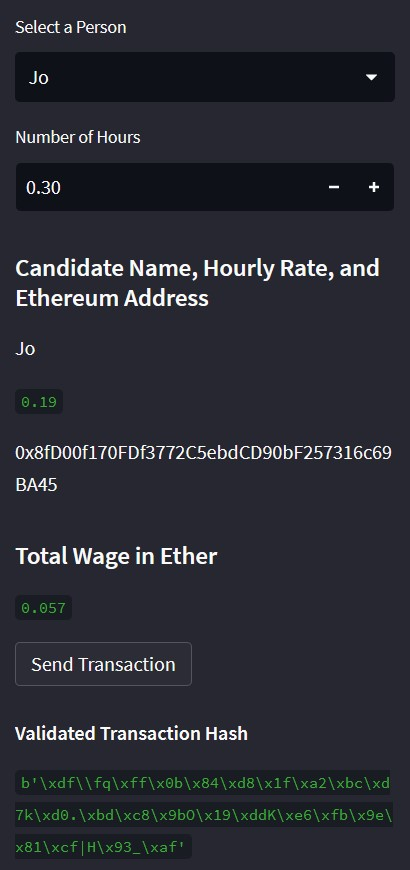
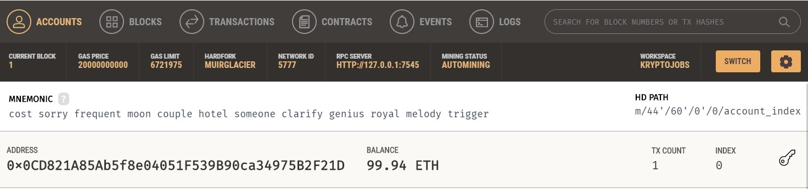
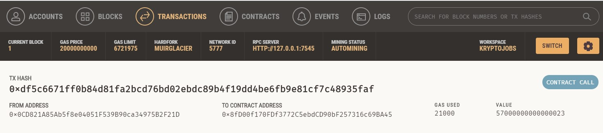
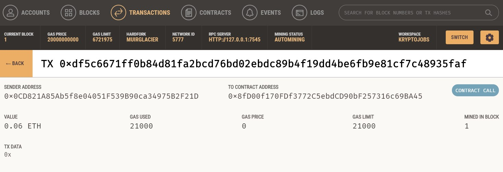

## KryptoJobs2Go

### Unit testing
* Select candidate Jo and number of hours required is 0.30 hours and click "send transaction" to sign and send the transaction with the Ethereum account.

* My account's ending address balance and history on Ganache (Note: Opening address balance = 100)

* Transaction details on Ganache

* Recipient's address balance and history from Ganache application

